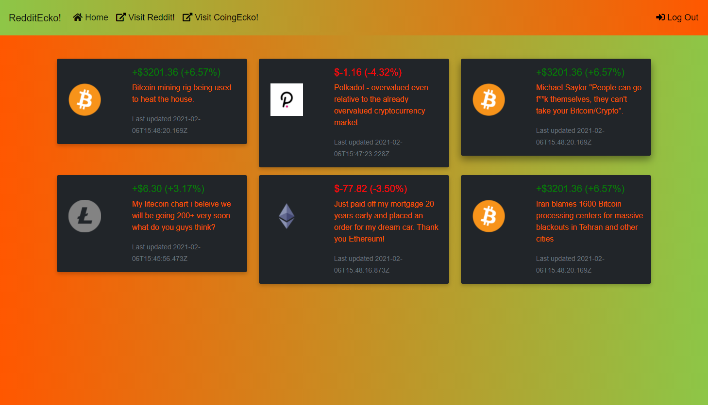

# Reddit-Tracker-for-Crypto

**Deployed application URL**
https://dragontalker.github.io/FrontEnd-EasyRedditTrackerForCrypto/

**GitHub Repository URL**
https://github.com/Dragontalker/FrontEnd-EasyRedditTrackerForCrypto

## Screenshot

## Table of Contents

* [Description](#description)
* [User_Story](#user_Story)
* [Features](#features)
* [Acceptance_Criteria](#acceptance_Criteria)
* [Wireframe](#wireframe)
* [Credits](#credits)
* [License](#license)
* [Badges](#badges)
* [Contributing](#contributing)
* [Tests](#tests)

## Description

### User_Story

- You are an investor in cryptocurrency.
- You need a web host where you can easily track my stocks investment.
- With the web host, you will be able to store your investment info, and keep updated with latest news.

### Features

**What needs are we meeting?**
- From the beginning, the system of how we buy and sell goods has always been changing.
With the advent of technological advancements, our society is changing rapidly. This change could and probably will include our world's current currency system.
With the looming changes, the investors have shown growing interest in the future of the currency system.
Under the changing global economic circumstances, we see a needs gap of many potential investors. We want to meet their needs, so that they may:
1. Be able to search the current stocks prices of User's choice of cryptocurrency.
2. Keep up to date with the latest news of the User's choices.
3. Be able to store the User's choices when he logs into the web host.

**What would be the foreseeable consequence of the needs if unmet?**
- If we do not meet the aforementioned needs of the investors, then:
1. The investors will not be supplied with the broad array of options, so they may make an informed and confident decision in engaging in cryptocurrency investment.
2. We will not be able to inspire others to push our global interactions to the next step in history.

**What were our goals?**
- Wire up two server-side APIs.
- Construct a responsive UI.
- Create an interactive UI(i.e. respond to User's input).
- Use the client-side storage to store User's data object.
- Use a CSS framework: Bootstrap, but do NOT use JS popup dialogue boxes (i.e. JS alerts, confirms, or prompts).
- Exercise best coding practice.
- Deploy a working application to GitHub Repo.

**What have we done about it?**
- Wire up two server-side APIs:
    - **_Reddit and CoinGecko_**
- Construct a responsive UI:
    - **_Used Bootstrap_**
- Create an interactive UI(i.e. respond to User's input):
    - **_Used Bootstrap, JS, DOM_**
- Use the client-side storage to store User's data object.
    - **_Used localStorage_**
- Use a CSS framework: Bootstrap, but do NOT use JS popup dialogue boxes (i.e. JS alerts, confirms, or prompts).
    - **_Done_**
- Exercise best coding practice.
    - **_Done_**
- Deploy a working application to GitHub Repo.
    - **_Done_**

### Acceptance_Criteria

* GIVEN I am entering the web host,
    * WHEN I sign up,
        - THEN I am given a log-in data.
    * WHEN I log in,
        - THEN I am taken to my stored data.
    * WHEN I search a stock,
        - THEN I see current the stock price;
        - THEN I see current Reddit news.
    * WHEN I log out,
        - THEN my activities are saved.

## Wireframe

## Credits

#### Product Owner
Full Stack Developer - Sam K
Contact Him on GitHub: https://github.com/TalkingSkunk

#### Scrum Master
Full Stack Developer - Richard Y
Contact Him on GitHub: https://github.com/Dragontalker

#### Scrum Team
##### UI-UX Designer
Front End Developer - Shiva S
Contact Her on GitHub: https://github.com/shiva-shiva

##### API and data related
Back End Developer - Giovanni O
Contact Him on GitHub: https://github.com/Gio86krt

DevOps - Max H
Contact Him on GitHub: https://github.com/Simplyloveall

**Honourable Mentions**
Thanks to @Fil and @Luca B for their many guidances in this work.

**Third Party Asset Attributions**
https://getbootstrap.com/

**Tutorials**
https://www.w3schools.com/

## License

MIT License

Copyright (c) [2021] [Team-Force]

Permission is hereby granted, free of charge, to any person obtaining a copy
of this software and associated documentation files (the "Software"), to deal
in the Software without restriction, including without limitation the rights
to use, copy, modify, merge, publish, distribute, sublicense, and/or sell
copies of the Software, and to permit persons to whom the Software is
furnished to do so, subject to the following conditions:

The above copyright notice and this permission notice shall be included in all
copies or substantial portions of the Software.

THE SOFTWARE IS PROVIDED "AS IS", WITHOUT WARRANTY OF ANY KIND, EXPRESS OR
IMPLIED, INCLUDING BUT NOT LIMITED TO THE WARRANTIES OF MERCHANTABILITY,
FITNESS FOR A PARTICULAR PURPOSE AND NONINFRINGEMENT. IN NO EVENT SHALL THE
AUTHORS OR COPYRIGHT HOLDERS BE LIABLE FOR ANY CLAIM, DAMAGES OR OTHER
LIABILITY, WHETHER IN AN ACTION OF CONTRACT, TORT OR OTHERWISE, ARISING FROM,
OUT OF OR IN CONNECTION WITH THE SOFTWARE OR THE USE OR OTHER DEALINGS IN THE
SOFTWARE.

## Badges

## Contributing

[Contributor Covenant](https://www.contributor-covenant.org/version/2/0/code_of_conduct/code_of_conduct.md)

## Tests

No tests required for our application. No examples provided to run tests.

&copy; 2021 Team-Force